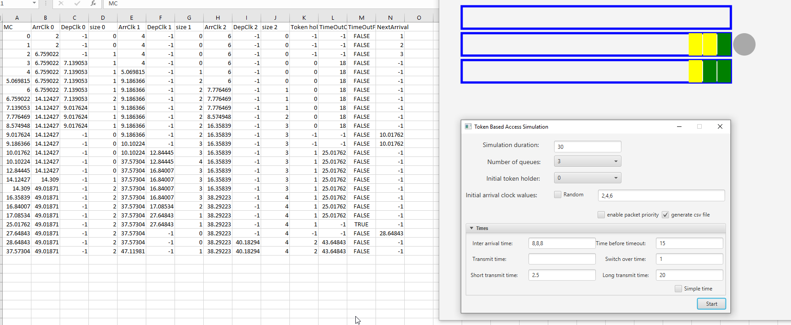

# TokenBasedAccess
This is a Java program that simulates the token-based access scheme in queing theory. The program outputs a details time table as well as a real time animation.

## Usage
1. Simulation duration: the total duration that the simulation will cover
2. Number of queues
3. Initial token holder: which queue initially holds the token
4. Initial arrival clock values: Specify when the first packet will arrive at each queue, can be set to a specific time or random.
5. Enable packet priority: Enables 2 type of packets, high priority and low priority packets
7. Simple time: if checked the inter arrival time and the transmition time are fixed, other wise they follow an exponential distribution.
6. Inter arrival time: the time between packets if ***Simple time*** is checked, otherwise the mean.
7. Time before timeout: Token time out.
8. Switch over time: how long it takes to pass the token from one queue to another
9. Transmit time: used when ***Simple time*** is used
10. Short/Long transmit time: When ***Simple time*** is not checked, 80% of the time the packets will take a short time to transmit and 20% of the time they will take a long time. The short and long times are exponentially distributed and these 2 parameters control their mean.

